# CAD_CRAFTING

A collection of my CAD designs from **2025–2026**, spanning robotics, underwater vehicles, and mechanical components — modeled primarily in Fusion 360.


---

## 🤖 AuraBot — Wheel-Leg Biped Robot

| Preview | Details |
|---|---|
| 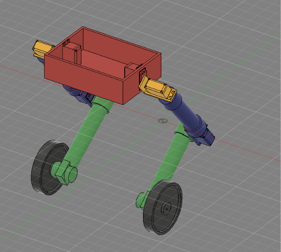 | **Model:** AuraBot chassis <br> **File:** [`AuraBot_F2URDfstl.stl`](./AuraBot_F2URDfstl.stl) |

---

## 🏎️ Line Follower Robot — IGNITE Chassis

| Preview | Details |
|---|---|
| 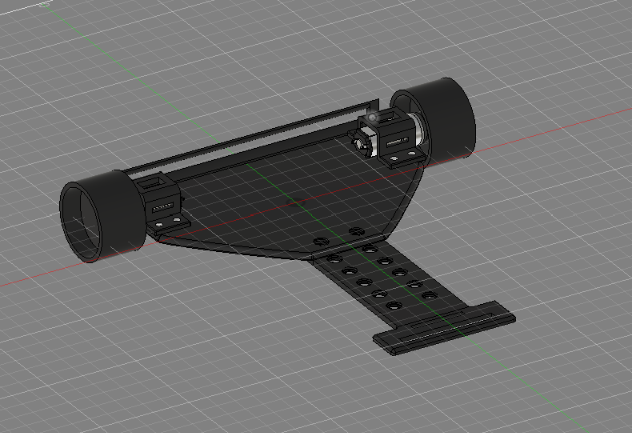 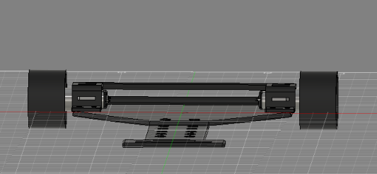 | **Model:** IGNITE line follower chassis <br> **File:** [`lFR IGNITE Chesis.stl`](./lFR%20IGNITE%20Chesis.stl) |

---

## 🌊 SeaHawk — Underwater ROV

### Full Assembly
| Preview | Details |
|---|---|
|  | **Model:** Underwater ROV prototype (4-thruster leg layout) <br> **File:** [`Underwater ROV prototype.stl`](./Underwater%20ROV%20prototype.stl) |
|  | **Model:** SeaHawk V2 — final hull assembly <br> **File:** [`SeaHawk_V2(April26).stl`](./SeaHawk_V2%28April26%29.stl) |
| 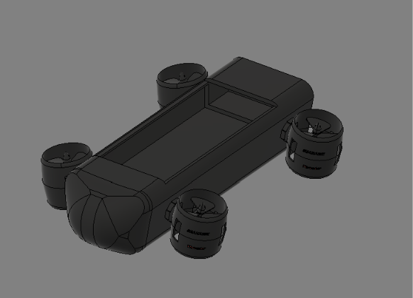 | **Model:** Lamprey MMAUV engineering revision <br> **File:** [`LampreyMMAUV_REV_Engineering.stl`](./LampreyMMAUV_REV_Engineering.stl) |

### Thruster Unit
| Preview | Details |
|---|---|
| 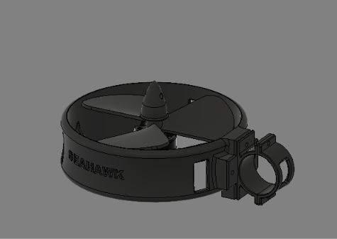 | **Model:** ROV thruster housing (v1) <br> **File:** [`ROVthruster3.stl`](./ROVthruster3.stl) |
| 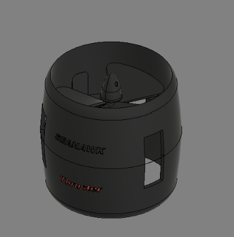 | **Model:** SeaHawk thruster housing <br> **File:** [`thruster.stl`](./thruster.stl) |

### Propeller
| Preview | Details |
|---|---|
| 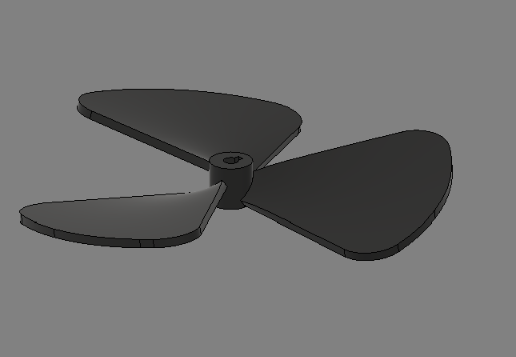 | **Model:** 3-blade propeller <br> **File:** [`propfor2.0.stl`](./propfor2.0.stl) |

### Body / Thruster Connector Clamp
| Preview | Details |
|---|---|
| 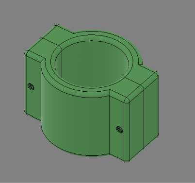 | **Model:** Body/thruster mounting clamp <br> **File:** [`bodyconnector.stl`](./bodyconnector.stl) <br> *(also see* [`thrusterConnector.stl`](./thrusterConnector.stl) *)* |

---

## ⚙️ Mechanical Components

### Motor Holder / Bracket
| Preview | Details |
|---|---|
|  | **Model:** 16GA motor holder <br> **File:** [`16GA motor holder.stl`](./16GA%20motor%20holder.stl) |
| 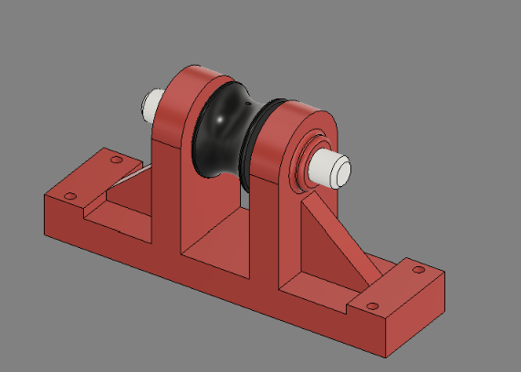 | **Model:** General mechanical mounting bracket <br> **File:** [`mechanical_tools12323.stl`](./mechanical_tools12323.stl) |

### Hardware — Hex Nut
| Preview | Details |
|---|---|
| 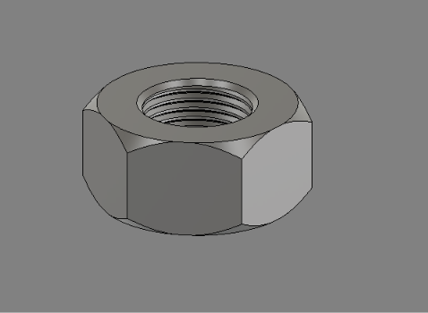 | **Model:** Standard hex nut <br> **File:** [`Nut.stl`](./Nut.stl) |

### Motor Grip Assembly
| Preview | Details |
|---|---|
| 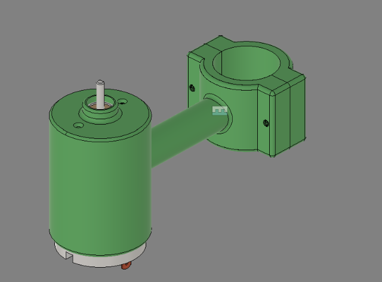 | **Model:** Motor grip / clamp assembly <br> **File:** [`motorgrip.stl`](./motorgrip.stl) |

---

## 📁 Repository Structure

```
CAD_CRAFTING/
├── README.md
├── images/                              # Render previews used in this README
│   ├── 02_line_follower_chassis_top.png
│   ├── 03_line_follower_chassis_front.png
│   ├── 05_thruster_unit_v1.png
│   ├── 06_propeller.png
│   ├── 16GA motor holder.png
│   ├── AuraBot_F2URDfstl.png
│   ├── bodyconnector.png
│   ├── LampreyMMAUV_REV_Engineering.png
│   ├── mechanical_tools12323.png
│   ├── motorgrip.png
│   ├── Nut.png
│   ├── SeaHawk_V2(April26).png
│   ├── thruster.png
│   └── Underwater ROV prototype.png
├── AuraBot_F2URDfstl.stl
├── lFR IGNITE Chesis.stl
├── Underwater ROV prototype.stl
├── SeaHawk_V2(April26).stl
├── LampreyMMAUV_REV_Engineering.stl
├── ROVthruster3.stl
├── thruster.stl
├── thrusterConnector.stl
├── bodyconnector.stl
├── propfor2.0.stl
├── 16GA motor holder.stl
├── mechanical_tools12323.stl
├── Nut.stl
└── motorgrip.stl
```

---

## 👤 About

**Md. Abdullah Al Sami Chowdhury**— 2nd-year EEE student at SUST, Bangladesh. Focused on robotics, embedded systems, and autonomous vehicle design.

- GitHub: [phosgene67](https://github.com/phosgene67)
- Portfolio: [fiboxsami.me](https://fiboxsami.me)